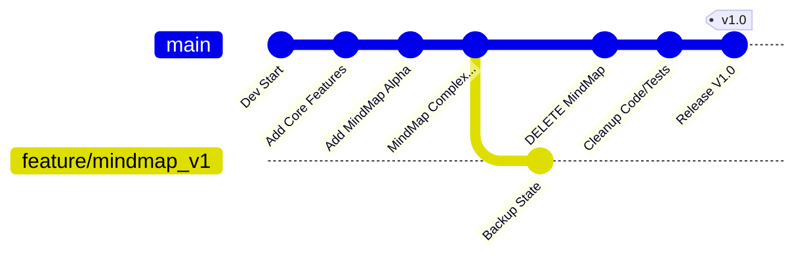

# FTIV V1.0 リリース: 大胆なピボットと「断捨離」の記録

日付: 2026-01-27
カテゴリ: リリース計画 / ポストモーテム

## 1. 概要: なぜマインドマップ機能を削除したのか？

FTIV は当初「軽量なオーバーレイ・ビューワー」として始まりましたが、開発途中で大規模な機能追加である「マインドマップモード」の実装が進められました。
しかし、V1.0 の正式リリースに向けた安定化フェーズにおいて、以下の問題が浮き彫りになりました。

*   **複雑性の爆発**: マインドマップ機能の追加により、コードベースの肥大化、UI/UXの混迷、メンテナンスコストの増大が発生。
*   **コア価値の希薄化**: 「サッと起動してサッと使う」というFTIV本来の強みが損なわれつつあった。
*   **「完成」への遠さ**: マインドマップ機能を品質高く仕上げるには、さらに膨大な時間が必要だった。

そこで、**「勇気ある撤退（ピボット）」**を決断しました。
V1.0 ではマインドマップ機能を外科的に切除し、コア機能に集中した「高品質な単機能ツール」としてリリースすることにしました。

## 2. Gitによる「安全な撤退戦」

機能を削除することは、エンジニアにとって心理的抵抗が大きい（サンクコストバイアス）ですが、Git の適切な運用によりこれを克服しました。

### ブランチ戦略
1.  **バックアップブランチの作成**:
    削除作業を始める **直前** の状態を、`feature/mindmap_v1` というブランチ名で保存しました。
    ```bash
    git branch feature/mindmap_v1
    ```
    これにより、「いつでもマインドマップ機能ありの状態に戻せる」という保険ができました。

2.  **断捨離の実行 (master)**:
    `master` ブランチでは、`ui/mindmap` ディレクトリごと削除し、関連するテストや依存関係 (`requirements.txt` の `Pygments` など) もクリーンアップしました。

3.  **V1.0 タグの付与**:
    クリーンになった状態で `v1.0` タグを打ちました。

### 開発フローの図解


## 3. 実践から得られた教訓（教育的価値）

このプロセスは、実際のソフトウェア開発現場でも非常に重要な以下の教訓を含んでいます。

### (1) サンクコストバイアスとの戦い
「せっかくここまで作ったのに」という思いが、プロジェクトをデスマーチ（死の行進）に導くことがあります。
**「動かない・中途半端なコードは負債である」** と認識し、削除する決断こそがプロジェクトを救います。

### (2) Gitは「タイムマシン」
Gitがあるからこそ、私たちは破壊的な変更を恐れずに実行できます。
「消す」のではなく「歴史に残して、現在の作業場からは取り除く」と考えることで、精神的なハードルが劇的に下がります。

### (3) MVP (Minimum Viable Product) の再定義
「何でもできるソフト」は「何もできないソフト」になりがちです。
V1.0 のゴールを「全ての機能を載せること」から「コア機能が最高に使いやすいこと」へ再定義したことで、リリースに到達できました。

## 4. 今後の展望

現在の `master` (v1.0) は非常にクリーンで軽量です。
もし将来、マインドマップ機能を再導入したくなった場合は、以下の選択肢があります。

*   **A案**: `feature/mindmap_v1` ブランチから必要なコードだけを「プラグイン」として移植する。
*   **B案**: V1.0 のクリーンな設計をベースに、より洗練された形でゼロから実装し直す。

どちらにせよ、一度コードを捨てて身軽になったことで、次の一手を自由に選べるようになりました。
